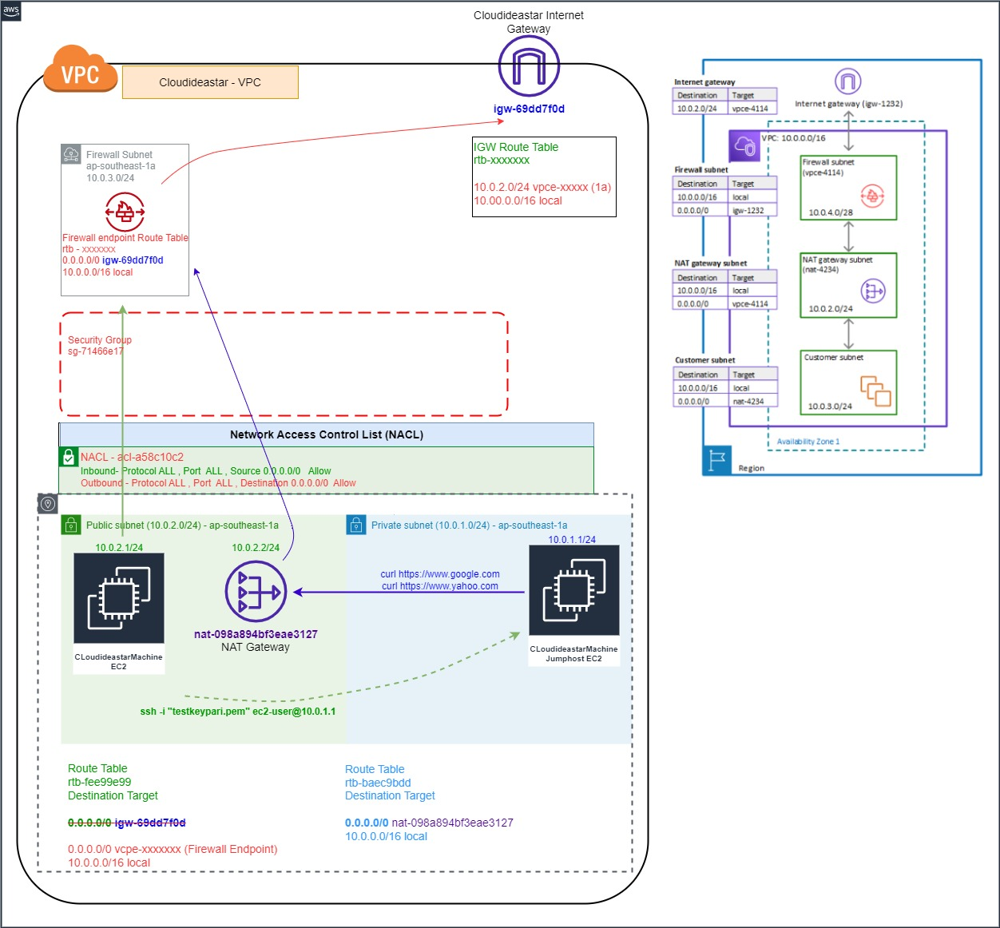
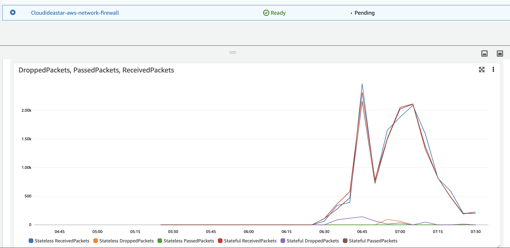
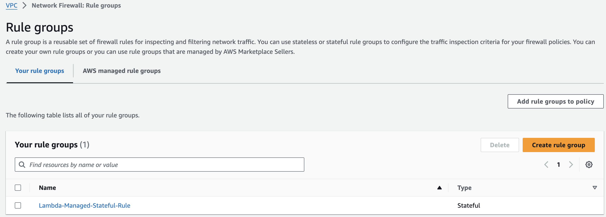
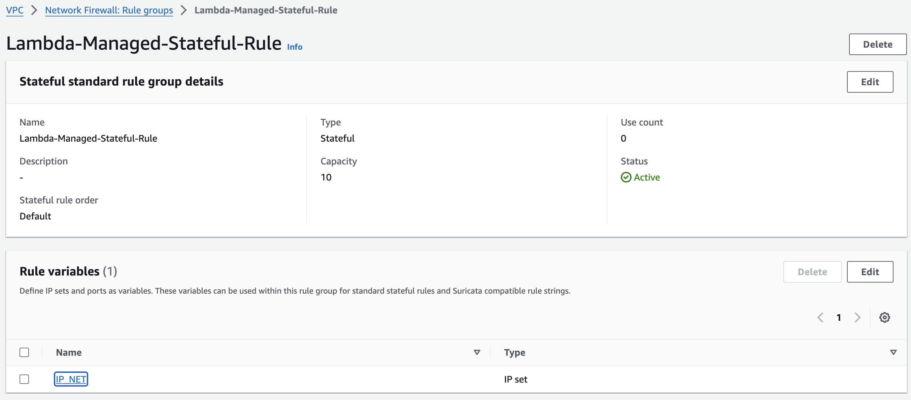
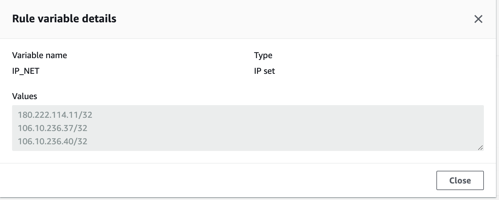

# STEP - 1. Generate the public key


1. Create keypair on aws web - "testkeypair"
2. Download the keypair and generate the keygen on same folder.
  - ssh-keygen -y -f testkeypair.pem

# STEP - 2. After spin up , need to update as below

1. Go to Endpoint>subnet -copy the FW subnet's "Network interface ID"
2. Go to Route table >IGW Route table > Edge associate > Edit edge associate > Check (Attach Internet Gateway) 
3. On IGW Route Table ,Add route EC2 IP/24 to FW interface (Gateway Load Balancer Endpoint) <10.0.2.0/24 - vpcexxxx>
4. On Public Route Table > Change Default route to FW subnet interface ID from IGW on EC2 public route table <0.0.0.0/0 - vpcexxxx>







## Test before/after  STEP 2 from Public EC2
1. curl http://10.0.2.xxx/
2. curl http://public_ip
3. http://public_ip
4. SSH to EC2
5. Ping to EC2 (public IP) from PC CMD


## STEP - 3 to access Private EC2 from Public EC2

Copy the testkeypair.pem file from local machine to EC2 Public EC2
1. cat testkeypair.pem > copy 
2. ssh to  public ec2 and past there > vi testkeypair.pem
3. Change permission > chmod 400 testkeypair.pem
4. SSH to private EC2 via public EC2

## STEP - 4 FQDN Firewall rule : workaround solution Lambda stack script is a YAML file format, FQDN (domains) that are resolved by the Lambda function and updating a Network Firewall rule variable with the result of the DNS qery.
1. Upload "LambdaFirewallRule.yml" file to cloudformation with aws console access.
2. Create stack > "upload a template file "
3. Lambda rule created at > VPC dashboard > " Network Firewall rule group "
4. Go to firewall policy and attach the created Lambda rule
5. FQDN that are resolved by the Lambda rule






## Test after  STEP 3 from Private EC2
1. curl http://public_ip
2. curl https://www.facebook.com
3. curl https://www.yahoo.com
4. curl https://www.google.com


### Command to Deploy
```bash
  - terraform init
  - terraform validate
  - terraform plan
  - terraform apply -auto-approve
  - Remove Step - 2 configuration, point VCPE (Firewawll subnet Interface ID)
  - terraform destroy -auto-approve
```  
